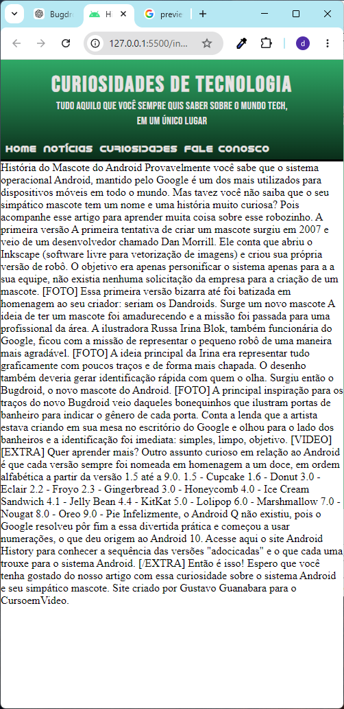
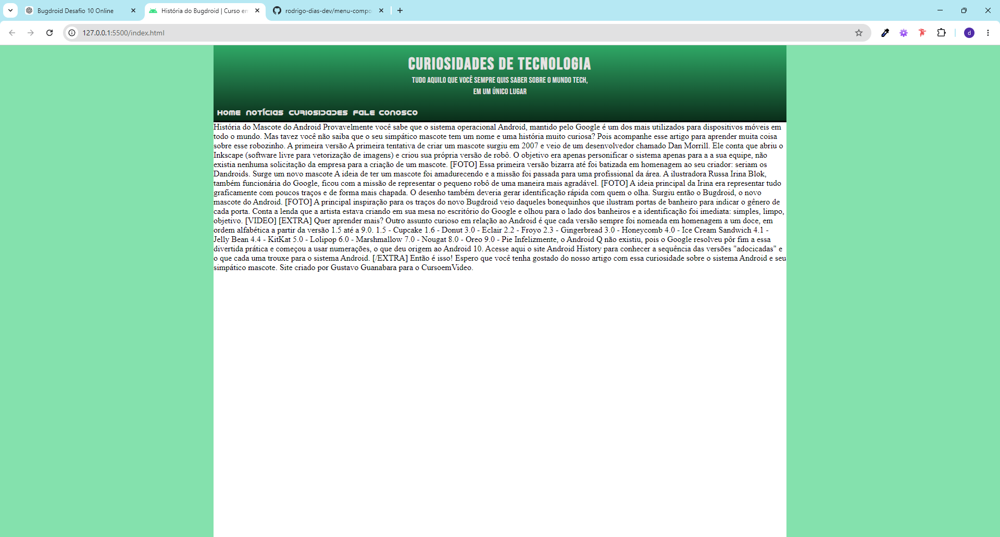

# História do Bugdroid | Desafio 10 - Curso em Vídeo

## 📸 Preview

<p align="center">
  
  
</p>

Projeto desenvolvido a partir do **Desafio 10** do Curso em Vídeo, com foco na construção de uma página responsiva inspirada no mascote do Android utilizando HTML5 e CSS3.

Além da reprodução visual do desafio, o projeto também busca aprofundar conceitos de:
- arquitetura HTML semântica;
- responsividade mobile-first;
- composição de layout;
- organização estrutural;
- refinamento tipográfico;
- separação de responsabilidades no CSS.

---

## 📚 Table of Contents

- [Overview](#-overview)
- [Screenshot](#-screenshot)
- [Links](#-links)
- [My Process](#-my-process)
  - [Built With](#-built-with)
  - [What I Learned](#-what-i-learned)
  - [Continued Development](#-continued-development)
  - [AI Collaboration](#-ai-collaboration)
- [Project Structure](#-project-structure)
- [Author](#-author)
- [Acknowledgments](#-acknowledgments)

---

## 🚀 Overview

Este projeto recria uma página temática sobre o mascote do Android (Bugdroid), utilizando HTML5 e CSS3 com abordagem mobile-first.

Durante o desenvolvimento, o foco principal foi compreender melhor:
- Flexbox;
- composição de containers;
- largura de leitura;
- alinhamento estrutural;
- organização semântica;
- refinamento responsivo.

---

## 📸 Screenshot

```md
Adicione aqui a screenshot do projeto.
```

Exemplo:

```md

```

---

## 🔗 Links

- Repositório: [GitHub Repository](#)
- Live Site: [Visualizar Projeto](#)

---

# 🛠 My Process

## ⚙ Built With

- Semantic HTML5
- CSS3
- CSS Custom Properties
- Flexbox
- Mobile-first workflow
- Responsive Design
- Google Fonts

---

## 🧠 What I Learned

Durante este projeto aprofundei principalmente:

- separação entre layout estrutural e composição textual;
- organização de containers;
- controle de largura de leitura;
- refinamento de spacing;
- arquitetura CSS mais organizada;
- debugging visual utilizando DevTools.

### Exemplo de composição textual

```css
.header-text {
    width: min(22rem, 100%);
    margin: 0 auto;
}
```

Essa abordagem permitiu criar um bloco textual mais fluido e confortável para leitura em dispositivos móveis.

---

## 📈 Continued Development

Pretendo continuar evoluindo:
- responsividade desktop;
- arquitetura semântica do conteúdo principal;
- componentização visual;
- acessibilidade;
- refinamento tipográfico;
- organização modular do CSS.

---

## 🤖 AI Collaboration

Durante o desenvolvimento utilizei IA como suporte para:
- debugging visual;
- análise arquitetural;
- refinamento responsivo;
- organização estrutural;
- reflexão sobre responsabilidades entre containers e componentes.

As discussões sobre:
- Flexbox;
- largura de leitura;
- composição textual;
- responsividade fluida;
- separação estrutural;

foram fundamentais para amadurecer a construção do projeto.

---

# 📁 Project Structure

```plaintext
bugdroid-project/
│
├── assets/
│   ├── css/
│   │   └── style.css
│   │
│   ├── fontes/
│   │   └── idroid.otf
│   │
│   └── media/
│       ├── favicon.ico
│       └── preview.png
│
├── index.html
└── README.md
```

---

# 👨‍💻 Author

- Rodrigo Dias
- Curso em Vídeo — Gustavo Guanabara

---

# 🙏 Acknowledgments

Projeto inspirado no Desafio 10 do Curso em Vídeo.

Agradecimentos ao professor Gustavo Guanabara pelo excelente material educacional e pela proposta prática do desafio.